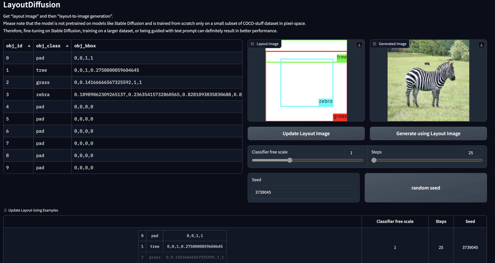
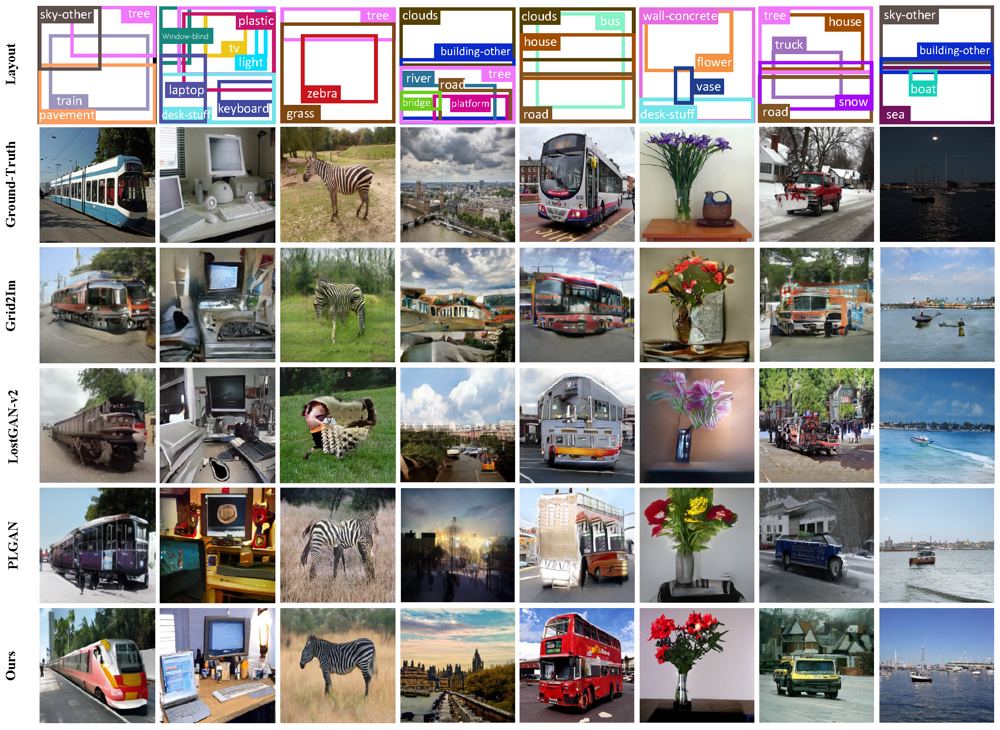

## News and ToDo List

- [ ] Improve README and code usage instructions
- [ ] Clean up code
- [ ] Code for Training on Latent Space using AutoEncoderKL, !!!COMING SOON!!! 
- [x] Release tools for evaluation
- [x] 2023-04-09: Release [pre-trained model](https://drive.google.com/drive/folders/1sJxbhi_pioFaHKgAAAuo8wZLIBuLbyxz?usp=sharing) 
- [x] 2023-04-09: Release instructions for environment and training 
- [x] 2023-04-09: Release Gradio Webui Demo
- [x] 2023-03-30: Publish complete code 
- [x] 2023-02-27: Accepted by CVPR2023 
- [x] 2022-11-11: Submitted to CVPR2023 
- [x] 2022-07-08: Publish initial code


## Introduction
This repository is the official implementation of CVPR2023: LayoutDiffusion: Controllable Diffusion Model for Layout-to-image Generation.

[](https://paperswithcode.com/sota/layout-to-image-generation-on-coco-stuff-4?p=layoutdiffusion-controllable-diffusion-model)

[](https://paperswithcode.com/sota/layout-to-image-generation-on-visual-genome-4?p=layoutdiffusion-controllable-diffusion-model)

* [papers with code](https://paperswithcode.com/paper/layoutdiffusion-controllable-diffusion-model)
* [arxiv](https://arxiv.org/abs/2303.17189)
* [cvpr open access paper pdf](https://openaccess.thecvf.com/content/CVPR2023/papers/Zheng_LayoutDiffusion_Controllable_Diffusion_Model_for_Layout-to-Image_Generation_CVPR_2023_paper.pdf)
* [cvpr open access supplement pdf](https://openaccess.thecvf.com/content/CVPR2023/supplemental/Zheng_LayoutDiffusion_Controllable_Diffusion_CVPR_2023_supplemental.pdf)


The code is heavily based on [openai/guided-diffusion](https://github.com/openai/guided-diffusion), 
with the following modifications:
1. Added support for Distributed Training of PyTorch.
2. Added support for OmegaConfig in ./configs for easy control
3. Added support for layout-to-image generation by introducing a layout encoder (layout fusion module or LFM) and object-aware cross-attention (OaCA).

## Gradio Webui Demo


## Pipeline


## Visualizations on COCO-stuff



## Setup Environment
```bash
conda create -n LayoutDiffusion python=3.8
conda activate LayoutDiffusion

conda install pytorch==1.10.1 torchvision==0.11.2 torchaudio==0.10.1 cudatoolkit=11.3 -c pytorch -c conda-forge
pip install omegaconf opencv-python h5py==3.2.1 gradio==3.33.1
pip install -e ./repositories/dpm_solver

python setup.py build develop
```

## Gradio Webui Demo (No need for setup of dataset)
```bash
  python scripts/launch_gradio_app.py  \
  --config_file configs/COCO-stuff_256x256/LayoutDiffusion_large.yaml \
  sample.pretrained_model_path=./pretrained_models/COCO-stuff_256x256_LayoutDiffusion_large_ema_1150000.pt
```
add '--share' after '--config_file XXX' to allow for remote link share

## Setup Dataset
See [here](./DATASET_SETUP.md)

## Pretrained Models
| Dataset                                                                                                                                   | Resolution |                   steps, FID (Sample imgs x times)                   | Link (TODO)                                                                                            |
|-------------------------------------------------------------------------------------------------------------------------------------------|:----------:|:--------------------------------------------------------------------:|--------------------------------------------------------------------------------------------------------|
| COCO-Stuff 2017 segmentation challenge<br/>([deprecated coco-stuff, not full coco-stuff](https://github.com/WillSuen/LostGANs/issues/19)) | 256 x 256  | steps=25 <br/> FID=15.61  ( 3097 x 5 ) <br/> FID=31.68  ( 2048 x 1 ) | [Google drive](https://drive.google.com/file/d/1aWIh-jPzNqXZibq8HlSeQfQzyXO8aMUK/view?usp=share_link)  | 
| COCO-Stuff 2017 segmentation challenge<br/>([deprecated coco-stuff, not full coco-stuff](https://github.com/WillSuen/LostGANs/issues/19)) | 256 x 256  | waiting | [Google drive](https://drive.google.com/file/d/1DaQllg4OwgjPwuE_zxNaGzYSnk_M4NoG/view?usp=sharing)  | 
| COCO-Stuff 2017 segmentation challenge<br/>([deprecated coco-stuff, not full coco-stuff](https://github.com/WillSuen/LostGANs/issues/19)) | 128 x 128  |               steps=25 <br/>  FID=16.57  ( 3097 x 5 )                | [Google drive](https://drive.google.com/file/d/1LoNKfGabuXc53gh1FYGbVvwbJZjpjE3a/view?usp=share_link)  | 
| VG                                                                                                                                        | 256 x 256  |               steps=25 <br/>  FID=15.63  ( 5097 x 1 )                | [Google drive](https://drive.google.com/file/d/16CV4a-4e8gyzOemK8XP0j4KwNL8PGb1L/view?usp=share_link)  | 
| VG                                                                                                                                        | 128 x 128  |               steps=25 <br/>  FID=16.35  ( 5097 x 1 )                | [Google drive](https://drive.google.com/file/d/1NaC3oS9uG0DmgU8VgIDB-xESauczuAaV/view?usp=share_link)  | 

## Training on Latent Space
* download the first stage model vae-8
```bash
    cd pretrained_models
    git clone https://huggingface.co/stabilityai/sd-vae-ft-ema
    cd sd-vae-ft-ema
    wget https://huggingface.co/stabilityai/sd-vae-ft-ema/resolve/main/diffusion_pytorch_model.bin -O diffusion_pytorch_model.bin
    wget https://huggingface.co/stabilityai/sd-vae-ft-ema/resolve/main/diffusion_pytorch_model.safetensors -O diffusion_pytorch_model.safetensors
    pip install --upgrade diffusers[torch]
```
```bash
python -m torch.distributed.launch \
       --nproc_per_node 8 \
       scripts/image_train_for_layout.py \
       --config_file ./configs/COCO-stuff_256x256/latent_LayoutDiffusion_large.yaml
```


## Training on Image Space
```bash
python -m torch.distributed.launch \
       --nproc_per_node 8 \
       scripts/image_train_for_layout.py \
       --config_file ./configs/COCO-stuff_256x256/LayoutDiffusion_large.yaml
```

## Sampling
* bash/quick_sample.bash for quick sample
* bash/sample.bash for sample entire test dataset

## Evaluation

**[Important] In each metrics, you should first configure the environment according to the specified repo.**

### FID
Fr‘echet Inception Distance (FID) were evaluated by using [TTUR](https://github.com/bioinf-jku/TTUR). 

After sampling, using the following command to measure the FID score:
```bash
CUDA_VISIBLE_DEVICES=0 python fid.py path/to/generated_imgs path/to/gt_imgs --gpu 0
```

### IS
Inception Score (IS) were evaluated by using [Improved-GAN](https://github.com/openai/improved-gan). 

After sampling, using the following command to measure the IS:
```bash
cd inception_score
CUDA_VISIBLE_DEVICES=0 python model.py --path path/to/generated_imgs
```

### DS
Diversity Score (DS) were evaluated by using [PerceptualSimilarity](https://github.com/richzhang/PerceptualSimilarity). 

We modified `lpips_2dirs.py` to make it easier to calculate the mean and variance of DS automatically, please refer [this](scripts/lpips_2dirs.py).

After sampling, using the following command to measure the IS:
```bash
CUDA_VISIBLE_DEVICES=0 python lpips_2dirs.py -d0 path/to/generated_imgs_0 -d1 path/to/generated_imgs_1 -o imgs/example_dists.txt --use_gpu
```


### YOLO Score
YOLO Score were evaluated by using [LAMA](https://github.com/ZejianLi/LAMA).

Since we filter the objects and images in datasets, we think it is better to evaluate bbox mAP only on filtered annotations. So we modified [`test.py`](scripts/lama_yoloscore_test.py) to measure YOLO Score both on full annotations(using `instances_val2017.json` in coco dataset) and [filtered annotations](https://drive.google.com/file/d/1T5A2AwNF2gZmi2LDArkE7ycBwGDuhq4w/view?usp=sharing).

After sampling, using the following command to measure the YOLO Score:
```bash
cd yolo_experiments
cd data
CUDA_VISIBLE_DEVICES=0 python test.py --image_path path/to/generated_imgs
```


### CAS
Classification Score (CAS) were evaluated by using [pytorch_image_classification](https://github.com/hysts/pytorch_image_classification).

We crop the GT box area of images and resize objects at a resolution of 32×32 with their class. Then train a ResNet101 classifier with cropped images on generated images and test it on cropped images on real images. Finally, measuring CAS using the generated images.

```bash
CUDA_VISIBLE_DEVICES=0 python evaluate.py --config configs/test.yaml
```

You should configure the ckpt path and dataset info in `configs/test.yaml`.


## For beginner
The field of layout-to-image generation is related to scenegraph-to-image generation and remained some confusing issues.
You could refer to issues like:
* [the deprecated coco-stuff 2017](https://github.com/WillSuen/LostGANs/issues/19)
* [FID, IS, LPIPS, CAS of LostGAN-v2](https://github.com/WillSuen/LostGANs/issues/3)
* [IS, FID, LPIPS, CAS of Grid2Im](https://github.com/ashual/scene_generation) 
* [IS, SceneIS, FID, SceneFID, LPIPS, CAS of AttrLostGAN](https://github.com/stanifrolov/AttrLostGAN)

However, it is recommended to ignore the confusing history and follow the latest [LDM](https://arxiv.org/pdf/2112.10752.pdf), [Frido](https://github.com/davidhalladay/Frido) to work on a relatively new benchmark.


## Cite
```
@InProceedings{Zheng_2023_CVPR,
    author    = {Zheng, Guangcong and Zhou, Xianpan and Li, Xuewei and Qi, Zhongang and Shan, Ying and Li, Xi},
    title     = {LayoutDiffusion: Controllable Diffusion Model for Layout-to-Image Generation},
    booktitle = {Proceedings of the IEEE/CVF Conference on Computer Vision and Pattern Recognition (CVPR)},
    month     = {June},
    year      = {2023},
    pages     = {22490-22499}
}
```
